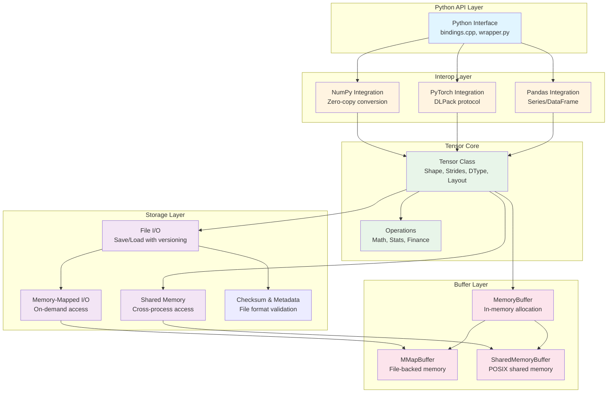

# Dragon Tensor

A high-performance tensor library written in C++17, designed specifically for financial data processing and quantitative analysis. Dragon Tensor provides seamless zero-copy integration with NumPy, Pandas, and PyTorch ecosystems, along with persistent storage and shared-memory support for high-performance data pipelines.

**Repository**: [https://github.com/zhongchun/dragon-tensor](https://github.com/zhongchun/dragon-tensor)

## Table of Contents

- [Features](#features)
- [Quick Start](#quick-start)
  - [Python Usage](#python-usage)
  - [C++ Usage](#c-usage)
- [Installation & Building](#installation--building)
  - [Prerequisites](#prerequisites)
  - [Quick Build with Script](#quick-build-with-script)
  - [Building from Source](#building-from-source)
  - [Using Makefile](#using-makefile)
  - [Building Python Wheel](#building-python-wheel)
  - [Code Formatting](#code-formatting)
- [Usage Examples](#usage-examples)
  - [Basic Operations](#basic-operations)
  - [Financial Analysis Examples](#financial-analysis-examples)
  - [Integration Examples](#integration-examples)
  - [Advanced: Persistent Storage](#advanced-persistent-storage)
  - [Advanced: Shared Memory](#advanced-shared-memory)
- [API Reference](#api-reference)
- [Project Structure & Architecture](#project-structure--architecture)
- [Performance](#performance)
- [Running Examples](#running-examples)
- [Troubleshooting](#troubleshooting)
- [Contributing](#contributing)
- [Version History](#version-history)
- [License & Citation](#license--citation)

## Features

- **High Performance**: C++17 implementation optimized for financial computations
- **Financial Operations**: Built-in support for returns, rolling windows, correlation, and covariance
- **Multi-dimensional Tensors**: Support for 1D, 2D, and higher-dimensional tensors
- **Statistical Operations**: Mean, std, variance, min, max with optional axis operations
- **Zero-Copy Interoperability**: Efficient zero-copy conversion with NumPy and PyTorch
- **NumPy Integration**: Seamless conversion to/from NumPy arrays (zero-copy when possible)
- **Pandas Integration**: Direct conversion from/to Pandas Series and DataFrames
- **PyTorch Integration**: Convert to/from PyTorch tensors (zero-copy via DLPack)
- **Matrix Operations**: Matrix multiplication, transpose, and more
- **Persistent Storage**: Save/load tensors to disk with versioned binary format
- **Memory-Mapped I/O**: On-demand access to large datasets via memory mapping
- **Shared Memory**: Cross-process tensor sharing via POSIX shared memory
- **Flexible Layouts**: Row-major and column-major storage layouts for query optimization
- **Robust File Format**: Versioned format with magic number, endian detection, and checksums

## Quick Start

### Python Usage

**Note:** After building, install the Python package:
```bash
pip install .
# Or if you used build.sh with --install, it's already installed
```

```python
import numpy as np
import dragon_tensor as dt

# Create a tensor from numpy array (zero-copy)
arr = np.array([1.0, 2.0, 3.0, 4.0, 5.0], dtype=np.float64)
tensor = dt.from_numpy_double(arr)

# Basic operations
print(tensor.sum())      # 15.0
print(tensor.mean())    # 3.0
print(tensor.std())     # 1.414...

# Financial operations
returns = tensor.returns()
rolling_mean = tensor.rolling_mean(window=3)

# Convert back to numpy (zero-copy)
result = tensor.to_numpy()
```

### C++ Usage

After building, the C++ headers are in `include/dragon_tensor/` and the library is in `build/libdragon_tensor.a`.

```cpp
#include <dragon_tensor/tensor.h>
#include <iostream>

using namespace dragon_tensor;

int main() {
    // Create a tensor
    TensorDouble prices({5}, {100.0, 102.0, 101.0, 105.0, 108.0});
    
    // Calculate returns
    auto returns = prices.returns();
    
    // Rolling statistics
    auto rolling_avg = prices.rolling_mean(3);
    auto rolling_std = prices.rolling_std(3);
    
    // Statistical operations
    std::cout << "Mean: " << prices.mean() << std::endl;
    std::cout << "Std: " << prices.std() << std::endl;
    
    return 0;
}
```

Compile with:
```bash
g++ -std=c++17 -I./include your_program.cpp -L./build -ldragon_tensor -o your_program
```

Or run the example:
```bash
./build/examples/example_basic
```

## Installation & Building

### Prerequisites

- C++17 compatible compiler (GCC 7+, Clang 5+, MSVC 2017+)
- CMake 3.15+
- Python 3.7+ (for Python bindings)
- pybind11 (will be installed automatically if missing)
- NumPy (will be installed automatically if missing)
- Pandas (optional, for pandas integration)
- PyTorch (optional, for torch integration)

### Quick Build with Script

The easiest way to build Dragon Tensor is using the provided build script:

```bash
# Clone the repository
git clone https://github.com/zhongchun/dragon-tensor.git
cd dragon-tensor

# Standard release build (recommended)
# Builds C++ library AND generates Python wheel automatically
./build.sh

# Debug build (also generates wheel)
./build.sh --debug

# Build and install Python package
./build.sh --install

# Build only C++ library (no Python bindings, no wheel)
./build.sh --no-python

# Build without wheel generation
./build.sh --no-wheel

# Clean build artifacts (wheels, build dir, Python cache)
./build.sh --clean              # Cleans and exits
./build.sh --clean --install    # Cleans, then builds and installs

# Build with tests
./build.sh --with-tests

# See all options
./build.sh --help
```

**Default Behavior:**
- By default, `./build.sh` builds the C++ library AND generates a Python wheel
- The wheel is created in `dist/` directory
- Use `--no-wheel` to disable wheel generation
- Use `--no-python` to build only C++ library (automatically disables wheel)

**Clean operation** (`--clean`):
- Removes build directory
- Removes `dist/` directory (Python wheels and source distributions)
- Cleans Python artifacts (`*.egg-info`, `__pycache__`, `.pyc`, `.pyo`)
- If used alone, exits after cleaning (no build)
- If combined with other options, cleans first then proceeds with build

The build script automatically:
- Checks for required dependencies (CMake, Python, pybind11, NumPy)
- Installs missing Python packages if needed
- Configures CMake with correct paths
- Builds all components in parallel
- Reports build status

### Building from Source

#### Using CMake directly:

```bash
# Create build directory
mkdir build && cd build

# Configure with CMake
cmake .. \
    -DCMAKE_BUILD_TYPE=Release \
    -DPython3_EXECUTABLE=$(which python3) \
    -Dpybind11_DIR=$(python3 -c "import pybind11; print(pybind11.get_cmake_dir())")

# Build
make -j$(nproc)

# Install Python package
cd ..
pip install .
```

#### CMake Build Options:

```bash
# Build the C++ library only
cmake .. -DBUILD_PYTHON_BINDINGS=OFF

# Build with Python bindings (default)
cmake .. -DBUILD_PYTHON_BINDINGS=ON

# Build with examples (default)
cmake .. -DBUILD_EXAMPLES=ON

# Build with tests
cmake .. -DBUILD_TESTS=ON

# Debug build
cmake .. -DCMAKE_BUILD_TYPE=Debug

# Release build with debug info
cmake .. -DCMAKE_BUILD_TYPE=RelWithDebInfo
```

### Using Makefile

```bash
# Build Targets
make                # Build C++ library and generate wheel (default, uses build.sh)
make build          # Build C++ library only (direct cmake, no wheel)
make build-wheel    # Build C++ library and generate wheel (uses build.sh)
make wheel          # Generate Python wheel only (requires build first)
make rebuild        # Clean and rebuild everything
make verify         # Build and run basic verification

# Installation
make install        # Install Python package
make install-dev    # Install in development mode

# Testing & Examples
make test           # Run tests
make examples       # Build and run C++ examples
make python-examples # Run Python examples

# Code Quality
make format         # Format all C++ and Python files
make format-check   # Check formatting without modifying
make format-cpp     # Format only C++ files (uses .clang-format)
make format-python  # Format only Python files
make lint           # Check formatting (alias for format-check)

# Cleanup
make clean          # Clean build directory only
make clean-all      # Clean build directory, wheels, and Python artifacts

# Help
make help           # Show all available targets
```

**Note:** By default, `make` (or `make all`) uses `build.sh` which automatically generates wheels. Use `make build` for direct CMake builds without wheel generation.

### Building Python Wheel

**Note:** The build script automatically generates Python wheels by default when Python bindings are enabled. No additional steps needed!

```bash
# Wheel is automatically generated when running:
./build.sh

# The wheel will be created in dist/ directory
# Example: dist/dragon_tensor-0.0.1-cp312-cp312-macosx_15_0_x86_64.whl
```

To build a wheel manually (if needed):

```bash
# Install build tools (if not already installed)
pip install build wheel

# Build wheel
python3 -m build --wheel

# Install from wheel
pip install dist/dragon_tensor-*.whl
```

### Code Formatting

The project uses **Google C++ Style Guide** as the default coding style, enforced via a `.clang-format` configuration file. This ensures all C++ code follows consistent formatting automatically.

#### Using format.sh

```bash
# Format all files (C++ and Python)
./format.sh

# Check formatting without modifying files
./format.sh --check

# Format only C++ files (uses .clang-format with Google style)
./format.sh -C

# Format only Python files
./format.sh -P
```

#### Using Makefile

```bash
make format         # Format all files
make format-check   # Check formatting without modifying
make format-cpp     # Format only C++ files
make format-python  # Format only Python files
make lint           # Check formatting (alias for format-check)
```

**C++ Style**: Google C++ Style Guide (enforced via `.clang-format`)  
**Python Style**: Black formatter

**Note**: When `clang-format` is run in this project (including via IDEs and editors), it will automatically use the Google style configuration from `.clang-format`.

The format script automatically:
- Formats C++ files using `clang-format` with Google style
- Formats Python files using `black`
- Installs missing Python formatting tools if needed
- Skips build directories and other non-source files

## Usage Examples

### Basic Operations

```python
import dragon_tensor as dt
import numpy as np

# Create tensor from numpy array
arr = np.array([1.0, 2.0, 3.0, 4.0, 5.0], dtype=np.float64)
tensor = dt.from_numpy_double(arr)

# Statistical operations
print(tensor.sum())      # 15.0
print(tensor.mean())     # 3.0
print(tensor.std())      # 1.414...
print(tensor.max())      # 5.0
print(tensor.min())      # 1.0

# Mathematical operations
abs_tensor = tensor.abs()
sqrt_tensor = tensor.sqrt()
exp_tensor = tensor.exp()

# Reshape and flatten
reshaped = tensor.reshape([1, 5])
flattened = tensor.flatten()
```

### Financial Analysis Examples

#### Returns Calculation

```python
import dragon_tensor as dt
import numpy as np

# Price series
prices = np.array([100, 102, 101, 105, 108, 110], dtype=np.float64)
tensor = dt.from_numpy_double(prices)

# Calculate returns
returns = tensor.returns()
print(returns.to_numpy())  # [0.02, -0.0098, 0.0396, 0.0286, 0.0185]
```

#### Rolling Window Statistics

```python
# Rolling mean and standard deviation
rolling_mean = tensor.rolling_mean(3)
rolling_std = tensor.rolling_std(3)

print("Rolling Mean:", rolling_mean.to_numpy())
print("Rolling Std:", rolling_std.to_numpy())
```

#### Correlation Analysis

```python
# Two asset price series
asset1 = dt.from_numpy_double(np.array([100, 102, 101, 105, 108], dtype=np.float64))
asset2 = dt.from_numpy_double(np.array([50, 51, 50.5, 52.5, 54], dtype=np.float64))

# Calculate correlation
corr = asset1.correlation(asset2)
print("Correlation:", corr.to_numpy()[0])

# Covariance
cov = asset1.covariance(asset2)
print("Covariance:", cov.to_numpy()[0])
```

### Integration Examples

#### Integration with Pandas

```python
import pandas as pd
import dragon_tensor as dt

# Load financial data
df = pd.DataFrame({'price': [100, 102, 101, 105, 108]})
tensor = dt.from_pandas_series(df['price'])

# Perform calculations
returns = tensor.returns()
rolling_volatility = tensor.rolling_std(window=20)

# Convert back to pandas
returns_series = pd.Series(returns.to_numpy(), index=df.index[1:])
```

#### Integration with PyTorch

```python
import torch
import dragon_tensor as dt

# Create PyTorch tensor
torch_tensor = torch.randn(100, dtype=torch.float64)

# Convert to Dragon Tensor (zero-copy when torch tensor is CPU and contiguous)
dt_tensor = dt.from_torch(torch_tensor)

# Perform calculations
result = dt_tensor.rolling_mean(window=10)

# Convert back to PyTorch (zero-copy)
result_torch = result.to_torch()
```

### Advanced: Persistent Storage

```python
import dragon_tensor as dt
import numpy as np

# Create and save tensor
prices = np.random.randn(252, 1000).astype(np.float64)
tensor = dt.from_numpy_double(prices)

# Save to disk with column-major layout (optimized for per-asset queries)
tensor.save("prices.dt", layout="column")

# Load with memory mapping (zero-copy, on-demand access)
mapped_tensor = dt.TensorDouble.load("prices.dt", mmap=True)

# Access data without loading full file into memory
np_view = mapped_tensor.to_numpy()  # Zero-copy view

# Force write-back for file-backed tensors
mapped_tensor.flush()
```

### Advanced: Shared Memory

```python
import dragon_tensor as dt

# Process 1: Create shared-memory tensor
shared = dt.TensorDouble.create_shared(
    "risk_shared", shape=(252, 500), dtype="float64", layout="row"
)

# Process 2: Attach to shared memory (in another process/script)
attached = dt.TensorDouble.attach_shared("risk_shared")

# Both processes can access the same memory
# Modify data in one process, it's immediately visible in the other

# When done:
shared.flush()  # Ensure writes are visible
shared.detach()  # Unmap (but shared memory persists)

# Cleanup (when no longer needed):
dt.TensorDouble.destroy_shared("risk_shared")
```

## API Reference

### Core Operations

- **Shape Operations**: `shape()`, `ndim()`, `size()`, `reshape()`, `flatten()`
- **Element Access**: `[]`, `at()`
- **Arithmetic**: `+`, `-`, `*`, `/` (element-wise and with scalars)
- **Mathematical**: `abs()`, `sqrt()`, `exp()`, `log()`, `pow()`

### Statistical Operations

- **Aggregation**: `sum()`, `mean()`, `std()`, `var()`, `max()`, `min()`
- **Axis Operations**: `sum(axis)`, `mean(axis)`, `std(axis)`, etc.

### Financial Operations

- `returns()`: Calculate percentage returns
- `rolling_mean(window)`: Rolling average
- `rolling_std(window)`: Rolling standard deviation
- `rolling_sum(window)`: Rolling sum
- `rolling_max(window)`: Rolling maximum
- `rolling_min(window)`: Rolling minimum
- `correlation(other)`: Correlation coefficient
- `covariance(other)`: Covariance

### Matrix Operations (2D only)

- `transpose()`: Matrix transpose
- `matmul(other)`: Matrix multiplication

### Storage Operations (v0.2)

- `save(path, layout="row")`: Save tensor to file with specified layout
- `load(path, mmap=True)`: Load tensor from file, optionally using memory mapping
- `create_shared(name, shape, dtype, layout)`: Create shared-memory tensor
- `attach_shared(name)`: Attach to existing shared-memory tensor
- `detach()`: Unmap shared-memory tensor
- `destroy_shared(name)`: Destroy shared-memory segment (static method)
- `flush()`: Force write-back for file-backed tensors

## Project Structure & Architecture

### Architecture Overview

Dragon Tensor follows a layered architecture design that separates concerns from memory management to user interfaces:



**Alternative Text Diagram:**

```
┌─────────────────────────────────────────────────────────────┐
│                    Python API Layer                         │
│  (bindings.cpp, wrapper.py, __init__.py)                   │
└────────────────────┬────────────────────────────────────────┘
                     │
┌─────────────────────────────────────────────────────────────┐
│                    Interop Layer                            │
│  ┌─────────────┐  ┌─────────────┐  ┌─────────────┐         │
│  │   NumPy     │  │   PyTorch   │  │   Pandas    │         │
│  │  (zero-copy)│  │   (DLPack)  │  │ Series/DF   │         │
│  └─────────────┘  └─────────────┘  └─────────────┘         │
└────────────────────┬────────────────────────────────────────┘
                     │
┌─────────────────────────────────────────────────────────────┐
│                    Tensor Core                              │
│  ┌────────────────────────────────────────────────────┐    │
│  │  Tensor Class: Shape, Strides, DType, Layout       │    │
│  └────────────────────────────────────────────────────┘    │
│  ┌────────────────────────────────────────────────────┐    │
│  │  Operations: Math, Stats, Finance, Matrix Ops      │    │
│  └────────────────────────────────────────────────────┘    │
└────────┬────────────────────────────┬──────────────────────┘
         │                            │
┌─────────────────────────────────────┴──────────────────────┐
│                    Storage Layer                            │
│  ┌──────────────┐  ┌──────────────┐  ┌──────────────┐     │
│  │   File I/O   │  │ Memory-Mapped│  │   Shared     │     │
│  │  (versioned) │  │      I/O      │  │   Memory     │     │
│  └──────────────┘  └──────────────┘  └──────────────┘     │
│  ┌────────────────────────────────────────────────────┐    │
│  │  Checksum & Metadata (file format validation)     │    │
│  └────────────────────────────────────────────────────┘    │
└────────┬────────────────────────────┬──────────────────────┘
         │                            │
┌─────────────────────────────────────┴──────────────────────┐
│                    Buffer Layer                             │
│  ┌──────────────┐  ┌──────────────┐  ┌──────────────┐     │
│  │  MemoryBuffer│  │  MMapBuffer  │  │SharedMemory │     │
│  │ (heap alloc)  │  │(file-backed) │  │   Buffer    │     │
│  └──────────────┘  └──────────────┘  └──────────────┘     │
└─────────────────────────────────────────────────────────────┘
         │                            │
    [Memory]                    [OS File/Shared Memory]
```

**Layer Descriptions:**

1. **Buffer Layer** (Bottom): Manages memory allocation and lifecycle
   - `MemoryBuffer`: Standard heap-allocated memory
   - `MMapBuffer`: Memory-mapped file-backed buffers
   - `SharedMemoryBuffer`: POSIX shared memory for cross-process access

2. **Storage Layer**: Handles persistence and shared access
   - File I/O with versioned binary format
   - Memory-mapped I/O for large datasets
   - Shared memory lifecycle management
   - Checksum validation and metadata

3. **Tensor Core**: Computation abstraction
   - Shape, strides, dtype, and layout metadata
   - Mathematical, statistical, and financial operations
   - View-based slicing and reshaping

4. **Interop Layer**: Ecosystem integration
   - Zero-copy NumPy conversion
   - PyTorch integration via DLPack
   - Pandas Series/DataFrame conversion

5. **Python API Layer** (Top): User-facing interface
   - Pybind11 bindings
   - Convenience wrapper functions
   - Context managers for resource management

### Project Structure

```
dragon-tensor/
├── include/
│   └── dragon_tensor/
│       ├── tensor.h               # Tensor class header (declarations)
│       ├── buffer.h               # Buffer abstraction for memory management
│       ├── storage.h              # Storage modes, layouts, and metadata
│       └── io.h                   # File I/O utilities
├── src/
│   ├── tensor.cpp                 # Tensor implementation with explicit template instantiations
│   ├── buffer.cpp                 # Buffer implementations (Memory, MMap, SharedMemory)
│   ├── storage.cpp                # Storage utilities (checksum, etc.)
│   └── io.cpp                     # File I/O implementation
├── python/
│   ├── bindings.cpp               # Python bindings (pybind11)
│   └── dragon_tensor/
│       ├── __init__.py            # Python package initialization
│       └── wrapper.py             # Convenience wrapper functions
├── examples/                      # Example code
├── CMakeLists.txt                 # CMake build configuration
├── build.sh                       # Build script
├── format.sh                      # Code formatting script
├── Makefile                       # Makefile with convenience targets
└── setup.py                       # Python package setup
```

**Implementation Notes:**
- The Tensor class is a template class with implementations in `src/tensor.cpp`
- Explicit template instantiations are provided for: `float`, `double`, `int32_t`, `int64_t`, `uint8_t`
- These correspond to `TensorFloat`, `TensorDouble`, `TensorInt`, `TensorLong` type aliases
- Buffer abstraction allows seamless switching between memory modes
- Storage layer provides unified interface for file and shared memory operations

## Performance

Dragon Tensor is optimized for financial computations:

- **Memory Efficient**: Minimal overhead compared to raw arrays
- **Fast Operations**: Vectorized operations where possible
- **Zero-copy Conversions**: Efficient zero-copy conversion between NumPy/Pandas/PyTorch formats
- **Memory-Mapped I/O**: On-demand access to large datasets without full load
- **Shared Memory**: Ultra-low latency inter-process access for real-time analytics
- **Layout Optimization**: Row-major and column-major layouts for query-optimized access patterns
- **Deterministic Memory Management**: Explicit buffer lifecycle control via Buffer abstraction

## Running Examples

### C++ Examples

```bash
# Build and run the basic example
./build/examples/example_basic

# Or using make
make examples
```

### Python Examples

After building, you can test the Python bindings:

```bash
# Import and test (requires module in path)
python3 -c "import sys; sys.path.insert(0, './build'); \
import dragon_tensor as dt; import numpy as np; \
arr = np.array([1.0, 2.0, 3.0, 4.0, 5.0], dtype=np.float64); \
tensor = dt.from_numpy_double(arr); \
print('Sum:', tensor.sum()); print('Mean:', tensor.mean())"

# Run example scripts (requires proper installation)
python3 examples/basic_usage.py
python3 examples/financial_analysis.py
python3 examples/integration_examples.py
```

## Troubleshooting

### pybind11 not found

If CMake cannot find pybind11:
```bash
pip install pybind11
```

The build script will automatically detect and use pybind11 from Python if installed via pip.

### NumPy not found

The build script will automatically install NumPy if missing. For manual installation:
```bash
pip install numpy
```

### Python module not found after build

The Python extension module is built in the `build/` directory. To use it without installation:

```bash
# Create a symlink for easier import (macOS/Linux)
cd build
ln -sf dragon_tensor*.dylib dragon_tensor.so  # macOS
# or
ln -sf dragon_tensor*.so dragon_tensor.so    # Linux
cd ..

# Then import with build directory in path
python3 -c "import sys; sys.path.insert(0, './build'); import dragon_tensor"
```

For permanent use, install the package:
```bash
pip install .
# or with build script
./build.sh --install
```

## Contributing

Contributions are welcome! Please feel free to submit a Pull Request.

Before submitting:
1. Run `make format` or `./format.sh` to ensure code is properly formatted
2. Run `make verify` to verify the build works
3. Ensure all tests pass (`make test`)
4. Update documentation if needed

## Version History

### v0.2 (Current)
- **Storage Layer**: File I/O with versioned binary format, memory-mapped I/O
- **Shared Memory**: POSIX shared memory support for cross-process tensor sharing
- **Buffer Abstraction**: Flexible memory management (in-memory, mmap, shared memory)
- **Extended DType**: Added `UINT8`, planned `DECIMAL64/128` support
- **Layout Control**: Row-major and column-major storage layouts
- **Zero-Copy Improvements**: Enhanced zero-copy conversions with NumPy and PyTorch

### v0.1
- Core tensor operations
- Financial analysis functions
- NumPy/Pandas/PyTorch integration
- Basic statistical operations

## License & Citation

### License

MIT License

### Citation

If you use Dragon Tensor in your research, please cite:

```bibtex
@software{dragon_tensor2024,
  title={Dragon Tensor: High-performance tensor library for financial data analysis},
  author={Dragon Tensor Contributors},
  year={2024},
  url={https://github.com/zhongchun/dragon-tensor}
}
```
