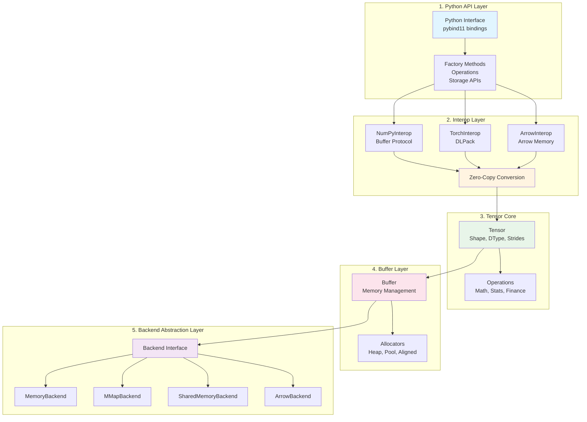

# Dragon Tensor

A high-performance tensor library written in C++17, designed specifically for financial data processing and quantitative analysis. Dragon Tensor provides seamless zero-copy integration with NumPy, Pandas, PyTorch, and Apache Arrow ecosystems, along with persistent storage and shared-memory support for high-performance data pipelines.

**Repository**: [https://github.com/zhongchun/dragon-tensor](https://github.com/zhongchun/dragon-tensor)

## Table of Contents

- [Features](#features)
- [Installation & Building](#installation--building)
  - [Prerequisites](#prerequisites)
  - [Quick Build with Script](#quick-build-with-script)
  - [Building from Source](#building-from-source)
  - [Building Python Wheel](#building-python-wheel)
- [Usage Examples](#usage-examples)
  - [Quick Start](#quick-start)
    - [Python Usage](#python-usage)
    - [C++ Usage](#c-usage)
  - [Basic Operations](#basic-operations)
  - [Financial Analysis Examples](#financial-analysis-examples)
  - [Integration Examples](#integration-examples)
  - [Advanced: Persistent Storage](#advanced-persistent-storage)
  - [Advanced: Shared Memory](#advanced-shared-memory)
- [API Reference](#api-reference)
  - [Quick Reference](#quick-reference)
- [Project Structure & Architecture](#project-structure--architecture)
  - [Architecture Overview](#architecture-overview)
  - [Project Structure](#project-structure)
- [Performance](#performance)
- [Running Examples](#running-examples)
  - [C++ Examples](#c-examples)
  - [Python Examples](#python-examples)
  - [Running Python Tests](#running-python-tests)
- [Troubleshooting](#troubleshooting)
  - [pybind11 not found](#pybind11-not-found)
  - [NumPy not found](#numpy-not-found)
  - [Python module not found after build](#python-module-not-found-after-build)
- [Contributing](#contributing)
  - [Code Formatting](#code-formatting)
- [Version Management](#version-management)
- [Version History](#version-history)
  - [v0.3 (Current)](#v03-current)
  - [v0.2](#v02)
  - [v0.1](#v01)
- [Documentation](#documentation)
  - [Quick Links](#quick-links)
- [License & Citation](#license--citation)
  - [License](#license)
  - [Citation](#citation)

## Features

- **High Performance**: C++17 implementation optimized for financial computations
- **Financial Operations**: Built-in support for returns, rolling windows, correlation, and covariance
- **Multi-dimensional Tensors**: Support for 1D, 2D, and higher-dimensional tensors
- **Statistical Operations**: Mean, std, variance, min, max with optional axis operations
- **Zero-Copy Interoperability**: Efficient zero-copy conversion with NumPy, PyTorch, and Apache Arrow
- **NumPy Integration**: Seamless conversion to/from NumPy arrays (zero-copy when possible)
- **Pandas Integration**: Direct conversion from/to Pandas Series and DataFrames
- **PyTorch Integration**: Convert to/from PyTorch tensors (zero-copy via DLPack)
- **Apache Arrow Integration**: Zero-copy conversion to/from Arrow Arrays and RecordBatches
- **Parquet File Support**: Save/load tensors in Parquet format with zero-copy memory mapping
- **Matrix Operations**: Matrix multiplication, transpose, and more
- **Persistent Storage**: Save/load tensors to disk with versioned binary format
- **Memory-Mapped I/O**: On-demand access to large datasets via memory mapping
- **Shared Memory**: Cross-process tensor sharing via POSIX shared memory
- **Flexible Layouts**: Row-major and column-major storage layouts for query optimization
- **Robust File Format**: Versioned format with magic number, endian detection, and checksums

## Installation & Building

### Prerequisites

- C++17 compatible compiler (GCC 7+, Clang 5+, MSVC 2017+)
- CMake 3.15+
- Python 3.7+ (for Python bindings)
- pybind11 (will be installed automatically if missing)
- NumPy (will be installed automatically if missing)
- Pandas (optional, for pandas integration)
- PyTorch (optional, for torch integration)
- Apache Arrow / pyarrow (optional, for Arrow/Parquet integration)

### Quick Build with Script

The easiest way to build Dragon Tensor is using the provided build script:

```bash
# Clone the repository
git clone https://github.com/zhongchun/dragon-tensor.git
cd dragon-tensor

# Standard release build (recommended)
# Builds C++ library AND generates Python wheel automatically
./build.sh

# Debug build (also generates wheel)
./build.sh --debug

# Build and install Python package
./build.sh --install

# Build only C++ library (no Python bindings, no wheel)
./build.sh --no-python

# Build without wheel generation
./build.sh --no-wheel

# Clean build artifacts (wheels, build dir, Python cache)
./build.sh --clean              # Cleans and exits
./build.sh --clean --install    # Cleans, then builds and installs

# Build with tests
./build.sh --with-tests

# See all options
./build.sh --help
```

**Default Behavior:**

- By default, `./build.sh` builds the C++ library AND generates a Python wheel
- The wheel is created in `dist/` directory
- Use `--no-wheel` to disable wheel generation
- Use `--no-python` to build only C++ library (automatically disables wheel)

**Clean operation** (`--clean`):

- Removes build directory
- Removes `dist/` directory (Python wheels and source distributions)
- Cleans Python artifacts (`*.egg-info`, `__pycache__`, `.pyc`, `.pyo`)
- If used alone, exits after cleaning (no build)
- If combined with other options, cleans first then proceeds with build

The build script automatically:

- Checks for required dependencies (CMake, Python, pybind11, NumPy)
- Installs missing Python packages if needed
- Configures CMake with correct paths
- **Uses Ninja build system** (faster than Make) if available
- **Enables ccache** for faster rebuilds (if installed)
- **Auto-detects CPU cores** and builds with optimal parallel jobs
- **Applies Release optimizations** (`-O3 -DNDEBUG`) for production builds
- Builds all components in parallel
- Reports build status

### Building from Source

#### Using CMake directly

```bash
# Create build directory
mkdir build && cd build

# Configure with CMake (use Ninja for faster builds)
cmake .. \
    -DCMAKE_BUILD_TYPE=Release \
    -G Ninja \
    -DCMAKE_CXX_FLAGS_RELEASE="-O3 -DNDEBUG" \
    -DPython3_EXECUTABLE=$(which python3) \
    -Dpybind11_DIR=$(python3 -c "import pybind11; print(pybind11.get_cmake_dir())")

# Build with parallel jobs
ninja -j$(nproc)
# Or with make: make -j$(nproc)

# Install Python package (setup.py will use pre-built extension)
cd ..
export CMAKE_BUILD_DIR=build
pip install .
```

#### CMake Build Options

```bash
# Build the C++ library only
cmake .. -DBUILD_PYTHON_BINDINGS=OFF

# Build with Python bindings (default)
cmake .. -DBUILD_PYTHON_BINDINGS=ON

# Build with examples (default)
cmake .. -DBUILD_EXAMPLES=ON

# Build with tests
cmake .. -DBUILD_TESTS=ON

# Debug build
cmake .. -DCMAKE_BUILD_TYPE=Debug

# Release build with debug info
cmake .. -DCMAKE_BUILD_TYPE=RelWithDebInfo
```

### Building Python Wheel

**Note:** The build script automatically generates Python wheels by default when Python bindings are enabled. No additional steps needed!

**Optimized Build Process:**
- C++ compilation is handled by CMake (with ccache/ninja optimizations)
- `setup.py` uses pre-built extension modules (no C++ compilation in Python build)
- Faster Python builds with better caching and parallel compilation

```bash
# Wheel is automatically generated when running:
./build.sh

# The wheel will be created in dist/ directory
# Example: dist/dragon_tensor-0.0.1-cp312-cp312-macosx_15_0_x86_64.whl
```

To build a wheel manually (if needed):

```bash
# First, build C++ extension with CMake
./build.sh --no-wheel

# Then build Python wheel (setup.py will use pre-built extension)
export CMAKE_BUILD_DIR=build
python3 -m build --wheel

# Install from wheel
pip install dist/dragon_tensor-*.whl
```

**Build Optimizations:**
- **ccache**: Speeds up rebuilds significantly (install with `brew install ccache` on macOS)
- **Ninja**: Faster build system than Make (install with `brew install ninja` on macOS)
- **Parallel builds**: Automatically uses all available CPU cores
- **Release flags**: `-O3 -DNDEBUG` for optimized production builds

## Usage Examples

### Quick Start

#### Python Usage

**Note:** After building, install the Python package:

```bash
pip install .
# Or if you used build.sh with --install, it's already installed
```

```python
import numpy as np
import dragon_tensor as dt

# Create a tensor from numpy array (zero-copy)
arr = np.array([1.0, 2.0, 3.0, 4.0, 5.0], dtype=np.float64)
tensor = dt.from_numpy_double(arr)

# Basic operations
print(tensor.sum())      # 15.0
print(tensor.mean())    # 3.0
print(tensor.std())     # 1.414...

# Financial operations
returns = tensor.returns()
rolling_mean = tensor.rolling_mean(window=3)

# Convert back to numpy (zero-copy)
result = tensor.to_numpy()

# Arrow integration (zero-copy)
import pyarrow as pa
arrow_arr = pa.array([1.0, 2.0, 3.0, 4.0, 5.0], type=pa.float64())
arrow_tensor = dt.from_arrow(arrow_arr)  # Zero-copy conversion
result_arrow = arrow_tensor.to_arrow()  # Convert back (zero-copy)
```

#### C++ Usage

After building, the C++ headers are in `include/dragon_tensor/` and the library is in `build/libdragon_tensor.a`.

```cpp
#include <dragon_tensor/tensor.h>
#include <iostream>

using namespace dragon_tensor;

int main() {
    // Create a tensor
    TensorDouble prices({5}, {100.0, 102.0, 101.0, 105.0, 108.0});
    
    // Calculate returns
    auto returns = prices.returns();
    
    // Rolling statistics
    auto rolling_avg = prices.rolling_mean(3);
    auto rolling_std = prices.rolling_std(3);
    
    // Statistical operations
    std::cout << "Mean: " << prices.mean() << std::endl;
    std::cout << "Std: " << prices.std() << std::endl;
    
    return 0;
}
```

Compile with:

```bash
g++ -std=c++17 -I./include your_program.cpp -L./build -ldragon_tensor -o your_program
```

Or run the example:

```bash
./build/examples/example_basic
```

### Basic Operations

```python
import dragon_tensor as dt
import numpy as np

# Create tensor from numpy array
arr = np.array([1.0, 2.0, 3.0, 4.0, 5.0], dtype=np.float64)
tensor = dt.from_numpy_double(arr)

# Statistical operations
print(tensor.sum())      # 15.0
print(tensor.mean())     # 3.0
print(tensor.std())      # 1.414...
print(tensor.max())      # 5.0
print(tensor.min())      # 1.0

# Mathematical operations
abs_tensor = tensor.abs()
sqrt_tensor = tensor.sqrt()
exp_tensor = tensor.exp()

# Reshape and flatten
reshaped = tensor.reshape([1, 5])
flattened = tensor.flatten()
```

### Financial Analysis Examples

#### Returns Calculation

```python
import dragon_tensor as dt
import numpy as np

# Price series
prices = np.array([100, 102, 101, 105, 108, 110], dtype=np.float64)
tensor = dt.from_numpy_double(prices)

# Calculate returns
returns = tensor.returns()
print(returns.to_numpy())  # [0.02, -0.0098, 0.0396, 0.0286, 0.0185]
```

#### Rolling Window Statistics

```python
# Rolling mean and standard deviation
rolling_mean = tensor.rolling_mean(3)
rolling_std = tensor.rolling_std(3)

print("Rolling Mean:", rolling_mean.to_numpy())
print("Rolling Std:", rolling_std.to_numpy())
```

#### Correlation Analysis

```python
# Two asset price series
asset1 = dt.from_numpy_double(np.array([100, 102, 101, 105, 108], dtype=np.float64))
asset2 = dt.from_numpy_double(np.array([50, 51, 50.5, 52.5, 54], dtype=np.float64))

# Calculate correlation
corr = asset1.correlation(asset2)
print("Correlation:", corr.to_numpy()[0])

# Covariance
cov = asset1.covariance(asset2)
print("Covariance:", cov.to_numpy()[0])
```

### Integration Examples

#### Integration with Pandas

```python
import pandas as pd
import dragon_tensor as dt

# Load financial data
df = pd.DataFrame({'price': [100, 102, 101, 105, 108]})
tensor = dt.from_pandas_series(df['price'])

# Perform calculations
returns = tensor.returns()
rolling_volatility = tensor.rolling_std(window=20)

# Convert back to pandas
returns_series = pd.Series(returns.to_numpy(), index=df.index[1:])
```

#### Integration with PyTorch

```python
import torch
import dragon_tensor as dt

# Create PyTorch tensor
torch_tensor = torch.randn(100, dtype=torch.float64)

# Convert to Dragon Tensor (zero-copy when torch tensor is CPU and contiguous)
dt_tensor = dt.from_torch(torch_tensor)

# Perform calculations
result = dt_tensor.rolling_mean(window=10)

# Convert back to PyTorch (zero-copy)
result_torch = result.to_torch()
```

#### Integration with Apache Arrow

```python
import pyarrow as pa
import dragon_tensor as dt
import numpy as np

# Create Arrow Array
arrow_array = pa.array([100.0, 102.0, 101.0, 105.0, 108.0], type=pa.float64())

# Convert to Dragon Tensor (zero-copy when compatible)
tensor = dt.from_arrow(arrow_array)

# Perform financial calculations
returns = tensor.returns()
rolling_mean = tensor.rolling_mean(window=3)

# Convert back to Arrow (zero-copy)
result_arrow = returns.to_arrow()

# Work with RecordBatches
data = np.random.randn(252, 1000).astype(np.float64)
tensor_2d = dt.from_numpy_double(data)
arrow_array_2d = tensor_2d.to_arrow()

# Create RecordBatch from multiple Arrow arrays
batch = pa.RecordBatch.from_arrays([arrow_array, arrow_array_2d], ["prices", "data"])
```

### Advanced: Persistent Storage

```python
import dragon_tensor as dt
import numpy as np
import pyarrow as pa

# Create and save tensor
prices = np.random.randn(252, 1000).astype(np.float64)
tensor = dt.from_numpy_double(prices)

# Save to disk with column-major layout (optimized for per-asset queries)
tensor.save("prices.dt", layout="column")

# Load with memory mapping (zero-copy, on-demand access)
mapped_tensor = dt.TensorDouble.load("prices.dt", mmap=True)

# Access data without loading full file into memory
np_view = mapped_tensor.to_numpy()  # Zero-copy view

# Save to Parquet via Arrow (columnar format for analytics)
tensor.save_parquet("prices.parquet")

# Load from Parquet with memory mapping
parquet_tensor = dt.load_parquet("prices.parquet", mmap=True)
arrow_view = parquet_tensor.to_arrow()  # Zero-copy Arrow view

# Force write-back for file-backed tensors
mapped_tensor.flush()
```

### Advanced: Shared Memory

```python
import dragon_tensor as dt

# Process 1: Create shared-memory tensor
shared = dt.TensorDouble.create_shared(
    "risk_shared", shape=(252, 500), dtype="float64", layout="row"
)

# Process 2: Attach to shared memory (in another process/script)
attached = dt.TensorDouble.attach_shared("risk_shared")

# Both processes can access the same memory
# Modify data in one process, it's immediately visible in the other

# When done:
shared.flush()  # Ensure writes are visible
shared.detach()  # Unmap (but shared memory persists)

# Cleanup (when no longer needed):
dt.TensorDouble.destroy_shared("risk_shared")
```

## API Reference

For complete API documentation, see:

- **[C++ API Reference](docs/api/cpp_api_reference.md)** - Complete C++ API with detailed method signatures
- **[Python API Reference](docs/api/python_api_reference.md)** - Complete Python API with examples

### Quick Reference

#### Core Operations

- **Shape Operations**: `shape()`, `ndim()`, `size()`, `reshape()`, `flatten()`
- **Element Access**: `[]`, `at()`
- **Arithmetic**: `+`, `-`, `*`, `/` (element-wise and with scalars)
- **Mathematical**: `abs()`, `sqrt()`, `exp()`, `log()`, `pow()`

#### Statistical Operations

- **Aggregation**: `sum()`, `mean()`, `std()`, `var()`, `max()`, `min()`
- **Axis Operations**: `sum(axis)`, `mean(axis)`, `std(axis)`, etc.

#### Financial Operations

- `returns()`: Calculate percentage returns
- `rolling_mean(window)`: Rolling average
- `rolling_std(window)`: Rolling standard deviation
- `rolling_sum(window)`: Rolling sum
- `rolling_max(window)`: Rolling maximum
- `rolling_min(window)`: Rolling minimum
- `correlation(other)`: Correlation coefficient
- `covariance(other)`: Covariance

#### Matrix Operations (2D only)

- `transpose()`: Matrix transpose
- `matmul(other)`: Matrix multiplication

#### Storage Operations (v0.2)

- `save(path, layout="row")`: Save tensor to file with specified layout
- `load(path, mmap=True)`: Load tensor from file, optionally using memory mapping
- `create_shared(name, shape, dtype, layout)`: Create shared-memory tensor
- `attach_shared(name)`: Attach to existing shared-memory tensor
- `detach()`: Unmap shared-memory tensor
- `destroy_shared(name)`: Destroy shared-memory segment (static method)
- `flush()`: Force write-back for file-backed tensors

#### Arrow/Parquet Operations (v0.3)

- `save_parquet(path)`: Save tensor to Parquet file via Arrow (zero-copy when compatible)
- `load_parquet(path, mmap=True)`: Load tensor from Parquet file with optional memory mapping
- `from_arrow(arrow_array)`: Create tensor from Arrow Array (zero-copy when compatible)
- `to_arrow()`: Convert tensor to Arrow Array (zero-copy when possible)

## Project Structure & Architecture

### Architecture Overview

Dragon Tensor follows a **5-layer architecture** (as per `requirements_doc_0.3.md`) that separates concerns from user interfaces to storage backends:



**Alternative Text Diagram:**

```text
┌─────────────────────────────────────────────────────────────┐
│             1. Python API Layer                             │
│  (bindings.cpp, __init__.py, io.py, finance.py)             │
│  - Factory methods: from_numpy(), from_torch(), from_arrow() │
│  - Operations: mathematical, statistical, financial       │
│  - Storage APIs: save(), load(), create_shared(), etc.        │
└────────────────────┬────────────────────────────────────────┘
                     │
┌─────────────────────────────────────────────────────────────┐
│             2. Interop Layer                                 │
│  ┌─────────────┐  ┌─────────────┐  ┌─────────────┐         │
│  │ NumPyInterop│  │TorchInterop │  │ArrowInterop│         │
│  │ Buffer      │  │   DLPack    │  │Arrow Memory│         │
│  │  Protocol   │  │             │  │            │         │
│  └─────────────┘  └─────────────┘  └─────────────┘         │
│  Responsibilities: Zero-copy conversion, view semantics    │
└────────────────────┬────────────────────────────────────────┘
                     │
┌─────────────────────────────────────────────────────────────┐
│             3. Tensor Core                                   │
│  ┌────────────────────────────────────────────────────┐    │
│  │  Tensor<T>: Shape, DType, Strides, Layout         │    │
│  └────────────────────────────────────────────────────┘    │
│  ┌────────────────────────────────────────────────────┐    │
│  │  Operations: Math, Stats, Finance, Matrix Ops     │    │
│  └────────────────────────────────────────────────────┘    │
└────────────────────┬────────────────────────────────────────┘
                     │
┌─────────────────────────────────────────────────────────────┐
│             4. Buffer Layer                                 │
│  ┌────────────────────────────────────────────────────┐    │
│  │  Buffer: MemoryBuffer, MMapBuffer, SharedMemBuffer │    │
│  └────────────────────────────────────────────────────┘    │
│  ┌────────────────────────────────────────────────────┐    │
│  │  Allocators: HeapAllocator, PoolAllocator,         │    │
│  │             AlignedAllocator                      │    │
│  └────────────────────────────────────────────────────┘    │
└────────────────────┬────────────────────────────────────────┘
                     │
┌─────────────────────────────────────────────────────────────┐
│         5. Backend Abstraction Layer                         │
│  ┌──────────────┐  ┌──────────────┐  ┌──────────────┐     │
│  │ MemoryBackend│  │  MMapBackend  │  │SharedMemBack │     │
│  └──────────────┘  └──────────────┘  └──────────────┘     │
│  ┌────────────────────────────────────────────────────┐    │
│  │           ArrowBackend (Arrow/Parquet)             │    │
│  └────────────────────────────────────────────────────┘    │
│  Unified interface for all storage backends                │
└─────────────────────────────────────────────────────────────┘
```

**Layer Descriptions:**

1. **Python API Layer** (Top): User-facing interface
   - High-level Python bindings via pybind11
   - Factory methods: `from_numpy()`, `from_torch()`, `from_arrow()`
   - Operations: mathematical, statistical, financial
   - Storage APIs: `save()`, `load()`, `create_shared()`, etc.
   - Context managers for resource lifecycle

2. **Interop Layer**: Ecosystem integration with zero-copy conversion
   - **NumPyInterop**: Zero-copy via array interface protocol
   - **TorchInterop**: DLPack protocol support for tensor sharing
   - **ArrowInterop**: Arrow memory layout and Parquet support
   - Format detection and automatic conversion
   - View semantics preservation

3. **Tensor Core**: Computation abstraction
   - Shape, strides, dtype, and layout metadata
   - Mathematical, statistical, and financial operations
   - View-based slicing and reshaping
   - Multi-dimensional tensor support

4. **Buffer Layer**: Memory management with allocator abstraction
   - **Buffer Types**: `MemoryBuffer`, `MMapBuffer`, `SharedMemoryBuffer`
   - **Allocators**: `HeapAllocator`, `PoolAllocator`, `AlignedAllocator`
   - Deterministic memory lifecycle management
   - RAII-based resource management

5. **Backend Abstraction Layer** (Bottom): Unified storage interface
   - **Backend Interface**: Abstract base for all storage types
   - **MemoryBackend**: Heap-allocated memory
   - **MMapBackend**: Memory-mapped file I/O
   - **SharedMemoryBackend**: POSIX shared memory
   - **ArrowBackend**: Apache Arrow/Parquet storage (planned)
   - Runtime backend selection based on use case

### Project Structure

```text
dragon-tensor/
├── VERSION.txt                    # Single source of truth for version (used by C++ and Python)
├── CMakeLists.txt                 # CMake build configuration
├── setup.py                       # Python package setup (reads version from VERSION.txt)
├── pyproject.toml                 # Python package metadata
├── build.sh                       # Automated build script
├── format.sh                      # Code formatting script
├── scripts/
│   └── test_build.sh              # Build verification script
├── requirements.txt               # Python dependencies
│
├── include/
│   └── dragon_tensor/
│       ├── tensor.h               # Tensor class header
│       ├── buffer.h               # Buffer abstraction for memory management
│       ├── dtype.h                # Data type enumeration
│       ├── shape.h                # Shape utilities
│       ├── layout.h               # Memory layout enumeration
│       ├── storage.h              # Storage modes and metadata
│       ├── io.h                   # File I/O utilities
│       ├── backend.h              # Backend abstraction interface
│       ├── allocator.h            # Allocator interface (Heap, Pool, Aligned)
│       ├── version.h.in           # Template for version.h (generated from VERSION.txt)
│       ├── backends/              # Backend implementations
│       │   ├── memory_backend.h
│       │   ├── mmap_backend.h
│       │   ├── sharedmem_backend.h
│       │   └── arrow_backend.h    # Arrow/Parquet backend
│       ├── interop/               # Interoperability headers (5-Layer Architecture: Interop Layer)
│       │   ├── numpy_interop.h    # NumPy zero-copy conversion
│       │   ├── torch_interop.h   # PyTorch DLPack zero-copy conversion
│       │   └── arrow_interop.h    # Arrow zero-copy conversion
│       └── utils/
│           └── logging.h          # Logging utilities
│
├── src/
│   ├── tensor.cpp                 # Tensor Core implementation
│   ├── buffer.cpp                 # Buffer Layer implementations
│   ├── allocator.cpp              # Allocator implementations (Heap, Pool, Aligned)
│   ├── backend_factory.cpp        # Backend factory functions
│   ├── io.cpp                     # File I/O implementation
│   ├── storage.cpp                # Storage utilities
│   ├── backends/                  # Backend Abstraction Layer implementations
│   │   ├── memory_backend.cpp
│   │   ├── mmap_backend.cpp
│   │   ├── sharedmem_backend.cpp
│   │   └── arrow_backend.cpp      # Arrow/Parquet backend
│   ├── utils/
│   │   └── logging.cpp            # Logging implementation
│   └── interop/                   # Interop Layer implementations
│       ├── numpy_interop.cpp      # NumPy interop implementation
│       ├── torch_interop.cpp      # PyTorch interop implementation
│       └── arrow_interop.cpp      # Arrow interop placeholder
│
├── python/
│   ├── bindings.cpp               # Python bindings (pybind11)
│   └── dragon_tensor/             # Python package
│       ├── __init__.py            # Package initialization (reads version from VERSION.txt)
│       ├── io.py                  # File I/O operations
│       ├── finance.py             # Financial operations
│       ├── shared.py              # Shared memory operations
│       └── utils.py               # Utility functions and interop
│
├── examples/                      # Example code
│   ├── cpp/                       # C++ examples
│   └── python/                    # Python examples
│
└── docs/                          # Documentation
    ├── design/                    # Design documents
    ├── api/                       # API reference
    ├── performance/               # Performance guides
    └── diagrams/                  # Architecture diagrams
```

**Implementation Notes:**

- **Version Management**: Version is stored in `VERSION.txt` and used by both C++ (via CMake-generated `version.h`) and Python (via `setup.py` and `__init__.py`)
- **Tensor Implementation**: Template class with explicit instantiations for `float`, `double`, `int32_t`, `int64_t`, `uint8_t`
- **Backend Abstraction**: Unified interface for storage backends (memory, mmap, shared memory, Arrow/Parquet)
- **Buffer Abstraction**: Flexible memory management with allocator support
- **Interop Layer**: Zero-copy integration with NumPy, PyTorch, and Apache Arrow
- **Modular Python API**: Organized into submodules (io, finance, shared, utils)

## Performance

Dragon Tensor is optimized for financial computations:

- **Memory Efficient**: Minimal overhead compared to raw arrays
- **Fast Operations**: Vectorized operations where possible
- **Zero-copy Conversions**: Efficient zero-copy conversion between NumPy, Pandas, PyTorch, and Apache Arrow formats
- **Memory-Mapped I/O**: On-demand access to large datasets without full load
- **Shared Memory**: Ultra-low latency inter-process access for real-time analytics
- **Layout Optimization**: Row-major and column-major layouts for query-optimized access patterns
- **Deterministic Memory Management**: Explicit buffer lifecycle control via Buffer abstraction
- **Arrow/Parquet Support**: Native integration with Apache Arrow for columnar analytics and Parquet file format

## Running Examples

### C++ Examples

```bash
# Build and run the basic example
./build/examples/example_basic
```

### Python Examples

After building, you can test the Python bindings:

```bash
# Import and test (requires module in path)
python3 -c "import sys; sys.path.insert(0, './build'); \
import dragon_tensor as dt; import numpy as np; \
arr = np.array([1.0, 2.0, 3.0, 4.0, 5.0], dtype=np.float64); \
tensor = dt.from_numpy_double(arr); \
print('Sum:', tensor.sum()); print('Mean:', tensor.mean())"

# Run example scripts (requires proper installation)
python3 examples/basic_usage.py
python3 examples/financial_analysis.py
python3 examples/integration_examples.py
```

### Running Python Tests

The project includes comprehensive pytest test suite located in `python/dragon_tensor/tests/`. To run the tests:

#### Prerequisites

```bash
# Install test dependencies
pip install -e ".[test]"
# or
pip install pytest pytest-cov
```

#### Running Tests

```bash
# Run all tests (from project root)
PYTHONPATH=python:$PYTHONPATH pytest

# Run with verbose output
PYTHONPATH=python:$PYTHONPATH pytest -v

# Run a specific test file
PYTHONPATH=python:$PYTHONPATH pytest python/dragon_tensor/tests/test_basic_operations.py

# Run a specific test class or function
PYTHONPATH=python:$PYTHONPATH pytest python/dragon_tensor/tests/test_basic_operations.py::TestTensorCreation
PYTHONPATH=python:$PYTHONPATH pytest python/dragon_tensor/tests/test_basic_operations.py::TestTensorCreation::test_from_numpy_float64

# Run tests matching a pattern
PYTHONPATH=python:$PYTHONPATH pytest -k finance
PYTHONPATH=python:$PYTHONPATH pytest -k numpy

# Run with coverage report
PYTHONPATH=python:$PYTHONPATH pytest --cov=dragon_tensor --cov-report=html
# Then open htmlcov/index.html in your browser

# Skip tests requiring optional dependencies
PYTHONPATH=python:$PYTHONPATH pytest -m "not requires_pandas and not requires_torch and not requires_arrow"
```

**Note:** If you install the package with `pip install -e .`, you can run `pytest` directly without setting `PYTHONPATH`.

#### Test Structure

The test suite includes:

- **`test_basic_operations.py`** (26 tests): Tensor creation, basic operations, arithmetic, matrix operations, tensor types
- **`test_numpy_integration.py`** (10 tests): NumPy round-trip conversions, dtype handling, edge cases
- **`test_finance.py`** (12 tests): Returns, rolling statistics, correlation, covariance, financial workflows
- **`test_io.py`** (10 tests): Save/load operations, memory mapping, layout options, error handling

**Total: 58 tests** covering the core functionality of Dragon Tensor.

## Troubleshooting

### pybind11 not found

If CMake cannot find pybind11:

```bash
pip install pybind11
```

The build script will automatically detect and use pybind11 from Python if installed via pip.

### NumPy not found

The build script will automatically install NumPy if missing. For manual installation:

```bash
pip install numpy
```

### Python module not found after build

The Python extension module is built in the `build/` directory. To use it without installation:

```bash
# Create a symlink for easier import (macOS/Linux)
cd build
ln -sf dragon_tensor*.dylib dragon_tensor.so  # macOS
# or
ln -sf dragon_tensor*.so dragon_tensor.so    # Linux
cd ..

# Then import with build directory in path
python3 -c "import sys; sys.path.insert(0, './build'); import dragon_tensor"
```

For permanent use, install the package:

```bash
pip install .
# or with build script
./build.sh --install
```

## Contributing

Contributions are welcome! Please feel free to submit a Pull Request.

Before submitting:

1. Run `./format.sh` to ensure code is properly formatted
2. Run `./scripts/test_build.sh` to verify the build works
3. Run the test suite: `PYTHONPATH=python:$PYTHONPATH pytest`
4. Ensure all tests pass
5. Update documentation if needed

### Code Formatting

The project uses **Google C++ Style Guide** as the default coding style, enforced via a `.clang-format` configuration file. This ensures all C++ code follows consistent formatting automatically.

#### Using format.sh

```bash
# Format all files (C++ and Python)
./format.sh

# Check formatting without modifying files
./format.sh --check

# Format only C++ files (uses .clang-format with Google style)
./format.sh -C

# Format only Python files
./format.sh -P
```

**C++ Style**: Google C++ Style Guide (enforced via `.clang-format`)  
**Python Style**: Black formatter

**Note**: When `clang-format` is run in this project (including via IDEs and editors), it will automatically use the Google style configuration from `.clang-format`.

The format script automatically:

- Formats C++ files using `clang-format` with Google style
- Formats Python files using `black`
- Installs missing Python formatting tools if needed
- Skips build directories and other non-source files

## Version Management

The project uses a **single source of truth** for version information:

- **`VERSION.txt`**: Contains the version string (e.g., `0.0.1`)
- **C++**: CMake reads `VERSION.txt` and generates `include/dragon_tensor/version.h` at build time
- **Python**: `setup.py` and `__init__.py` read directly from `VERSION.txt`

To update the version, simply edit `VERSION.txt` - all build systems will automatically use the new version.

## Version History

### v0.3 (Current)

- **Apache Arrow Integration**: Full zero-copy conversion to/from Arrow Arrays and RecordBatches
- **Parquet Support**: Save/load tensors in Parquet format with memory mapping support
- **Zero-Copy Arrow Operations**: Efficient data exchange with Arrow ecosystem without memory duplication
- **5-Layer Architecture**: Refined architecture with Backend Abstraction Layer
- **Allocator Abstraction**: Flexible memory management strategies
- **Enhanced Project Structure**: Modular organization with interop, backends, and utilities
- **Centralized Version Management**: Single `VERSION.txt` for all components

### v0.2

- **Storage Layer**: File I/O with versioned binary format, memory-mapped I/O
- **Shared Memory**: POSIX shared memory support for cross-process tensor sharing
- **Buffer Abstraction**: Flexible memory management (in-memory, mmap, shared memory)
- **Extended DType**: Added `UINT8`, planned `DECIMAL64/128` support
- **Layout Control**: Row-major and column-major storage layouts
- **Zero-Copy Improvements**: Enhanced zero-copy conversions with NumPy and PyTorch

### v0.1

- Core tensor operations
- Financial analysis functions
- NumPy/Pandas/PyTorch integration
- Basic statistical operations

## Documentation

Complete documentation is available in the [`docs/`](docs/README.md) directory. See the [Documentation Index](docs/README.md) for an overview.

### Quick Links

**API Documentation:**

- **[C++ API Reference](docs/api/cpp_api_reference.md)** - Comprehensive C++ API with method signatures, parameters, and examples
- **[Python API Reference](docs/api/python_api_reference.md)** - Complete Python API with usage examples and type conversion guide

**Design Documents:**

- **[Requirements Document v0.3](docs/design/requirements_doc_0.3.md)** - Latest design with Apache Arrow integration and 5-layer architecture
- **[Requirements Document v0.2](docs/design/requirements_doc_0.2.md)** - Enhanced design with storage layer, buffer abstraction, and shared memory support
- **[Requirements Document v0.1](docs/design/requirements_doc_0.1.md)** - Initial design and requirements specification
- **[UML Architecture](docs/design/uml_architecture.md)** - Visual architecture diagrams
- **[Backend Abstraction](docs/design/backend_abstraction.md)** - Backend layer design

**Performance & Optimization:**

- **[Performance Optimizations](docs/performance/optimizations.md)** - Comprehensive optimization guide

## License & Citation

### License

MIT License

### Citation

If you use Dragon Tensor in your research, please cite:

```bibtex
@software{dragon_tensor2025,
  title={Dragon Tensor: High-performance tensor library for financial data analysis},
  author={Dragon Tensor Contributors},
  year={2025},
  url={https://github.com/zhongchun/dragon-tensor}
}
```
