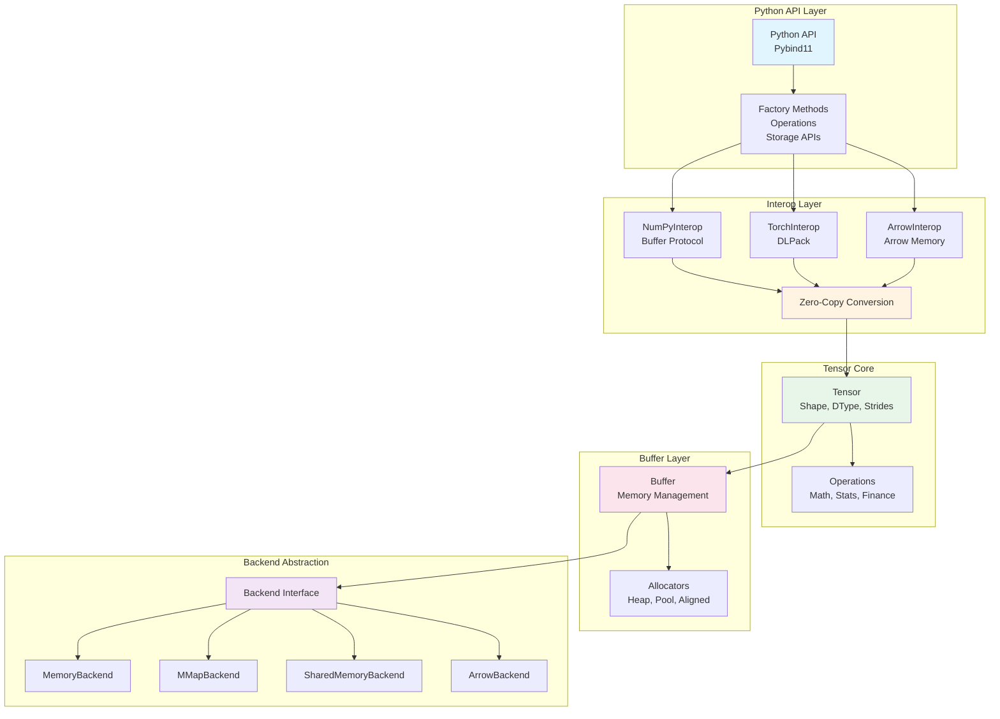

# Dragon-Tensor Design and Requirements Document (Financial Quantitative Analysis Edition, v3)

## 1. Overview

This document defines the design and requirements for **Dragon-Tensor**, a high-performance, extensible Tensor library implemented in C++. Dragon-Tensor is optimized for **financial data processing** and **quantitative analysis**, including portfolio optimization, time-series modeling, and machine learning. It provides a memory-efficient, high-precision foundation for analytics requiring low latency, zero-copy interoperability, and supports **persistent storage, shared-memory access, and Arrow integration** for high-performance data pipelines.

This version adds **Arrow/Parquet interoperability, refined layered architecture with Backend Abstraction Layer, and enhanced allocator support** for production-grade financial data workflows.

---

## 2. Objectives

### Functional Requirements

1. **General Tensor Support**: Handle 1D (vectors), 2D (matrices), and N-dimensional tensors for financial data.
2. **Interoperability**: Enable zero-copy conversion with:

   * **NumPy ndarray** (for analytics and simulation workflows)
   * **PyTorch Tensor** (for model training and GPU acceleration)
   * **Apache Arrow** (for columnar analytics and Parquet integration)
3. **Data Persistence and Shared Access**:

   * Store tensors in **files** (row-wise or column-wise layout) with **versioning and metadata**.
   * Use **memory-mapped (mmap)** I/O for on-demand retrieval without loading the full dataset.
   * Store tensors in **shared memory**, supporting both row-wise and column-wise layouts, with **explicit lifecycle management**.
   * Support **Arrow/Parquet formats** for efficient columnar data exchange.
4. **Financial Data Orientation**:

   * Efficient for large dense numeric datasets (e.g., price matrices, volatility surfaces)
   * Time-series slicing for rolling-window analysis
   * Columnar data layouts optimized for analytical queries
5. **Precision and Stability**: Support `float64`, `float32`, and planned fixed-point types (`DECIMAL64/128`) for accurate computation.
6. **Device Abstraction**: CPU-first design with GPU extensibility for risk simulations.

### Non-Functional Requirements

* **Zero-Copy** data sharing across ecosystems
* **High Throughput** for time-critical analytics
* **Extensible** modular design with clear layer boundaries
* **Deterministic Memory Control** via allocator abstraction
* **Persistent and Shared Storage** with predictable access latency
* **Python/Numpy/Torch/Arrow Compatibility**
* **Safe Shared-Memory Lifetime Management**
* **Production-Grade Backend Abstraction** for storage flexibility

---

## 3. Architecture Overview

### 3.1 Layered Structure

The architecture follows a clear 5-layer design from user-facing APIs to storage backends:

| Layer                         | Role                        | Description                                                                                                 |
| ----------------------------- | --------------------------- | ----------------------------------------------------------------------------------------------------------- |
| **Python API Layer**          | User Interface              | Exposes simple, intuitive APIs for analysts, including context management and lifecycle methods.             |
| **Interop Layer**             | Ecosystem Integration       | Provides zero-copy conversion with NumPy, PyTorch, and Apache Arrow. Handles format translation and view semantics. |
| **Tensor Core**               | Computation Abstraction     | Defines tensor metadata (Shape, DType, View, Strides) and core operations (math, stats, finance).            |
| **Buffer Layer**              | Memory Management           | Manages memory allocation via allocators, handles CPU/GPU memory, file-backed and shared-memory buffers with deterministic cleanup. |
| **Backend Abstraction Layer** | Storage Backends            | Abstract interface for storage backends (file I/O, mmap, shared memory, Arrow/Parquet). Provides unified access patterns. |

### 3.1.1 Architecture Diagram

**UML-Style Architecture Diagram:**

```
┌──────────────────────────────────────────────────────────────────────────────┐
│                           Python API Layer                                   │
│                                                                              │
│  Python API (Pybind11)                                                       │
│  ───────────────────────                                                    │
│  + from_numpy(np.ndarray) -> Tensor                                          │
│  + from_torch(torch.Tensor) -> Tensor                                        │
│  + from_arrow(arrow.Array) -> Tensor                                         │
│  + from_file(path, layout) -> Tensor                                         │
│  + from_shared(name, layout) -> Tensor                                       │
│  + Tensor operations: reshape(), view(), slice(), transpose()                │
│  + Mathematical ops: sum(), mean(), std(), abs(), sqrt()                     │
│  + Financial ops: rolling_mean(), returns(), correlation(), volatility()     │
│  + Storage ops: save(), load(), flush(), detach()                           │
└──────────────────────────────────────────────────────────────────────────────┘
                                   │
                                   │ provides high-level API
                                   ▼
┌──────────────────────────────────────────────────────────────────────────────┐
│                           Interop Layer                                      │
│                                                                              │
│  ┌─────────────────┐  ┌─────────────────┐  ┌─────────────────┐            │
│  │  NumPyInterop   │  │   TorchInterop  │  │   ArrowInterop  │            │
│  └─────────────────┘  └─────────────────┘  └─────────────────┘            │
│                                                                              │
│  Responsibilities:                                                           │
│    - Zero-copy via DLPack, buffer protocol, Arrow memory                    │
│    - Type/stride compatibility checking                                     │
│    - Device/context translation                                             │
│    - Schema and metadata preservation                                       │
│    - View semantics preservation                                            │
└──────────────────────────────────────────────────────────────────────────────┘
                                   │
                                   │ converts formats
                                   ▼
┌──────────────────────────────────────────────────────────────────────────────┐
│                           Tensor Core                                        │
│                                                                              │
│  template<typename T, size_t N>                                              │
│  class Tensor                                                                │
│  ───────────────────────                                                    │
│  Attributes:                                                                 │
│    - Shape shape_              // Multi-dimensional shape                    │
│    - DType dtype_              // Data type (FLOAT32, FLOAT64, etc.)       │
│    - Stride strides_           // Memory stride per dimension               │
│    - std::shared_ptr<Buffer> buffer_  // Memory buffer                      │
│    - Layout layout_            // ROW_MAJOR | COLUMN_MAJOR                 │
│    - TensorMeta meta_          // Optional metadata (labels, schema)        │
│                                                                              │
│  Operations:                                                                 │
│    + reshape(new_shape) -> Tensor                                            │
│    + view(dtype) -> Tensor                                                   │
│    + slice(range) -> Tensor                                                  │
│    + transpose() -> Tensor                                                   │
│    + layout() -> Layout                                                      │
│    + backend() -> Backend*                                                   │
│    + mathematical operations (+, -, *, /, abs, sqrt, etc.)                  │
│    + statistical operations (sum, mean, std, var, etc.)                      │
│    + financial operations (returns, rolling, correlation, etc.)             │
│                                                                              │
│  Design:                                                                     │
│    * Template-based with constexpr shapes for compile-time optimization     │
│    * Supports row-major & column-major layouts                              │
│    * View-based slicing (O(1) operations)                                   │
└──────────────────────────────────────────────────────────────────────────────┘
                                   │
                                   │ manages memory
                                   ▼
┌──────────────────────────────────────────────────────────────────────────────┐
│                           Buffer Layer                                       │
│                                                                              │
│  class Buffer                                                                 │
│  ───────────────────────                                                    │
│  Attributes:                                                                 │
│    - void* data_                // Raw memory pointer                       │
│    - size_t size_               // Buffer size in bytes                      │
│    - Layout layout_             // Memory layout                            │
│    - std::shared_ptr<Allocator> allocator_  // Allocation strategy          │
│    - std::shared_ptr<Backend> backend_     // Storage backend               │
│                                                                              │
│  Operations:                                                                 │
│    + data() -> void*                                                        │
│    + size() -> size_t                                                       │
│    + layout() -> Layout                                                     │
│    + allocate(size_t, Layout) -> void                                       │
│    + deallocate() -> void                                                   │
│    + map() / unmap()        // For memory-mapped files                      │
│    + attach() / detach()    // For shared memory                            │
│                                                                              │
│  Allocator Types:                                                            │
│    * HeapAllocator          // Standard heap allocation                    │
│    * PoolAllocator          // Pool-based for small tensors                 │
│    * AlignedAllocator       // SIMD-aligned allocation                     │
│                                                                              │
│  Design:                                                                     │
│    * Handles memory ownership, alignment, slicing                          │
│    * RAII-based lifetime management                                         │
└──────────────────────────────────────────────────────────────────────────────┘
                                   │
                                   │ uses storage backends
                                   ▼
┌──────────────────────────────────────────────────────────────────────────────┐
│                    Backend Abstraction Layer (Storage Layer)                 │
│                                                                              │
│  interface Backend                                                            │
│  ───────────────────────                                                    │
│  Operations:                                                                 │
│    + allocate(size_t, Layout) -> Buffer                                     │
│    + release(Buffer&) -> void                                                │
│    + name() -> std::string                                                   │
│    + flush() -> void                                                         │
│    + supports_mmap() -> bool                                                 │
│                                                                              │
│  Implementations:                                                             │
│    ┌──────────────────┐                                                     │
│    │ MemoryBackend    │  // Heap-allocated memory                           │
│    └──────────────────┘                                                     │
│    ┌──────────────────┐                                                     │
│    │ MMapBackend      │  // Memory-mapped file I/O                          │
│    └──────────────────┘                                                     │
│    ┌──────────────────┐                                                     │
│    │ SharedMemoryBackend│  // POSIX/System V shared memory                  │
│    └──────────────────┘                                                     │
│    ┌──────────────────┐                                                     │
│    │ ArrowBackend     │  // Apache Arrow/Parquet storage                   │
│    └──────────────────┘                                                     │
│                                                                              │
│  Design:                                                                     │
│    * Configurable layout: ROW_MAJOR / COLUMN_MAJOR                         │
│    * Backend chosen via Tensor creation factory methods                     │
│    * Unified interface regardless of underlying storage mechanism           │
└──────────────────────────────────────────────────────────────────────────────┘
```

**Mermaid Diagram (Alternative Visualization):**



### 3.2 Layer Responsibilities

#### Python API Layer
* High-level Python bindings via pybind11
* Context managers for resource lifecycle (`with dt.open(...)`)
* Convenience wrapper functions
* Type conversion helpers
* Error handling and exception translation

#### Interop Layer
* **NumPy Integration**: Zero-copy conversion using array interface protocol
* **PyTorch Integration**: DLPack protocol support for tensor sharing
* **Arrow Integration**: 
  * Convert between Dragon Tensor and Arrow Arrays/RecordBatches
  * Support for Arrow memory layouts (columnar, row-wise)
  * Parquet file read/write via Arrow
  * Schema-aware tensor creation from Arrow data
* Format detection and automatic conversion
* View semantics preservation

#### Tensor Core
* **Shape**: Multi-dimensional shape representation and validation
* **DType**: Type system (FLOAT32, FLOAT64, INT32, INT64, UINT8, DECIMAL64/128)
* **View**: Zero-copy views, slicing, and reshaping operations
* **Strides**: Memory layout management (row-major, column-major)
* **Operations**: Mathematical, statistical, and financial operations
* **Metadata**: TensorMeta for dimension names, labels, and custom attributes

#### Buffer Layer
* **Memory Management**: Allocation and deallocation policies
* **Allocators**: 
  * Standard heap allocator
  * Pool allocator for small tensors
  * Aligned allocator for SIMD operations
  * Custom allocator interface for user-defined strategies
* **Buffer Types**:
  * `MemoryBuffer`: Heap-allocated memory
  * `MMapBuffer`: File-backed memory-mapped buffers
  * `SharedMemoryBuffer`: POSIX shared memory buffers
* **Lifetime Management**: Reference counting, RAII patterns, deterministic cleanup

#### Backend Abstraction Layer
* **Storage Backend Interface**: Abstract base class for storage implementations
* **File Backend**: Traditional file I/O with versioned binary format
* **MMap Backend**: Memory-mapped file access
* **Shared Memory Backend**: POSIX/System V shared memory
* **Arrow/Parquet Backend**: Arrow-based storage with Parquet file support
* **Unified API**: Consistent interface regardless of backend implementation
* **Backend Selection**: Runtime selection based on use case and data characteristics

### 3.3 Data Model

Each `Tensor` object encapsulates:

* `std::shared_ptr<Buffer> buffer`: Underlying memory block (managed by Buffer Layer)
* `std::vector<size_t> shape`: Dimensions (e.g., [days, assets])
* `std::vector<size_t> strides`: Layout strides (bytes per step)
* `DType dtype`: Data type
* `StorageMode storage_mode`: {`InMemory`, `MMap`, `SharedMemory`, `Arrow`}
* `Layout layout`: {`RowMajor`, `ColumnMajor`}
* `TensorMeta meta`: Optional descriptive metadata (dim names, labels, Arrow schema)
* `std::shared_ptr<void> owner`: Cross-language lifetime management
* **Backend handle**: Reference to storage backend for persistence operations

---

## 4. Simplified Python API Design

Dragon-Tensor provides a **minimal, clean Python API**, extended for persistent storage, shared-memory tensors, and Arrow integration with context management and lifecycle methods.

### 4.1 Python API Overview

```python
import dragon_tensor as dt
import pyarrow as pa
import numpy as np

# From NumPy or Torch
t1 = dt.from_numpy(np_data)
t2 = dt.from_torch(torch_tensor)

# From Arrow
arrow_array = pa.array([1.0, 2.0, 3.0, 4.0, 5.0])
t3 = dt.from_arrow(arrow_array)

# Save tensor to disk (row-wise or column-wise)
t1.save("prices.dt", layout="row")

# Save to Parquet via Arrow
t1.save_parquet("prices.parquet")

# Load from Parquet
t_parquet = dt.load_parquet("prices.parquet")

# Memory-map from file with context manager
with dt.open("prices.dt", mmap=True) as mapped_t:
    np_view = mapped_t.to_numpy()

# Create shared-memory tensor
t_shared = dt.create_shared("shared_prices", shape=(252, 1000), dtype="float64", layout="column")

# Attach to shared-memory tensor from another process
t2 = dt.attach_shared("shared_prices")

# Zero-copy conversion
torch_view = t_shared.to_torch()
arrow_view = t_shared.to_arrow()  # New: Arrow conversion

# Explicit flush/detach
t_shared.flush()
t_shared.detach()
```

### 4.2 Python API Reference

| Function                                    | Description                                        | Zero-Copy   | Return         |
| ------------------------------------------- | -------------------------------------------------- | ----------- | -------------- |
| `from_numpy(array)`                         | Wrap NumPy ndarray                                 | ✅           | `Tensor`       |
| `from_torch(torch_tensor)`                  | Wrap PyTorch Tensor via DLPack                     | ✅           | `Tensor`       |
| `from_arrow(arrow_array)`                   | Create tensor from Arrow Array/RecordBatch         | ✅           | `Tensor`       |
| `to_numpy()`                                | Convert Tensor to NumPy ndarray                    | ✅           | `np.ndarray`   |
| `to_torch()`                                | Convert Tensor to PyTorch tensor                   | ✅           | `torch.Tensor` |
| `to_arrow()`                                | Convert Tensor to Arrow Array                      | ✅           | `pa.Array`     |
| `save(path, layout="row")`                  | Save tensor to file in row- or column-major layout | ❌           | `None`         |
| `save_parquet(path)`                        | Save tensor to Parquet file via Arrow              | ❌           | `None`         |
| `load_parquet(path)`                        | Load tensor from Parquet file                      | ✅ (mmap)    | `Tensor`       |
| `open(path, mmap=True)`                     | Context-managed load from file, optionally mmap    | ✅ (if mmap) | `Tensor`       |
| `create_shared(name, shape, dtype, layout)` | Create shared-memory tensor                        | ✅           | `Tensor`       |
| `attach_shared(name)`                       | Attach to existing shared-memory tensor            | ✅           | `Tensor`       |
| `flush()`                                   | Force write-back for file-backed tensors           | ❌           | `None`         |
| `detach()`                                  | Unmap shared-memory tensor                         | ❌           | `None`         |

---

## 5. Storage Layer Design

### 5.1 File-Based Storage

* **Row-wise layout**: Fast sequential access for time-series data
* **Column-wise layout**: Optimized for per-asset queries
* **Binary format with robust header**: includes **magic, version, endian, checksum**
* **mmap support**: On-demand access without full load

```cpp
struct TensorHeader {
    uint32_t magic = 0x44544E53; // 'DTNS'
    uint32_t version = 1;
    uint32_t ndim;
    uint32_t dtype;
    uint32_t layout;  // 0=row, 1=col
    uint32_t endian;   // 0=little, 1=big
    uint64_t shape[N];
    uint64_t data_offset;
    uint64_t checksum; // optional CRC64
};
```

### 5.2 Shared Memory Storage

* Uses POSIX or System V shared memory for cross-process access
* Supports **row-major** and **column-major** layouts
* Optional synchronization using **atomic header or named semaphores**
* Lifecycle management: `detach()`, `destroy_shared()`

```cpp
Tensor Tensor::create_shared(const std::string& name, Shape shape, DType dtype, Layout layout);
Tensor Tensor::attach_shared(const std::string& name);
void Tensor::detach();
static void Tensor::destroy_shared(const std::string& name);
```

### 5.3 Arrow/Parquet Storage

* **Arrow Integration**: Native support for Apache Arrow in-memory format
* **Parquet Support**: Read/write Parquet files using Arrow
* **Schema Preservation**: Maintain Arrow schema metadata in `TensorMeta`
* **Columnar Layout**: Efficient columnar access patterns
* **Zero-Copy Views**: Arrow arrays can wrap Dragon Tensor memory when compatible

```cpp
// Arrow integration
Tensor from_arrow(const arrow::Array& array);
std::shared_ptr<arrow::Array> to_arrow() const;

// Parquet support
void save_parquet(const std::string& path) const;
static Tensor load_parquet(const std::string& path, bool mmap = true);
```

---

## 6. Core API (C++)

### 6.1 Construction

```cpp
Tensor(std::shared_ptr<Buffer> buffer,
       std::vector<size_t> shape,
       DType dtype,
       std::vector<size_t> strides = {},
       Layout layout = Layout::RowMajor,
       StorageMode mode = StorageMode::InMemory,
       TensorMeta meta = {});
```

### 6.2 Storage APIs

```cpp
// File I/O
void save(const std::string& path, Layout layout = Layout::RowMajor) const;
static Tensor load(const std::string& path, bool mmap = true);

// Shared memory
static Tensor create_shared(const std::string& name, Shape shape, DType dtype, Layout layout);
static Tensor attach_shared(const std::string& name);
void detach();
static void destroy_shared(const std::string& name);

// Arrow/Parquet
static Tensor from_arrow(const arrow::Array& array);
std::shared_ptr<arrow::Array> to_arrow() const;
void save_parquet(const std::string& path) const;
static Tensor load_parquet(const std::string& path, bool mmap = true);

// Lifecycle
void flush();  // force write-back for file-backed or mmap tensors
```

### 6.3 Allocator Interface

```cpp
class Allocator {
public:
    virtual ~Allocator() = default;
    virtual void* allocate(size_t size, size_t alignment = alignof(std::max_align_t)) = 0;
    virtual void deallocate(void* ptr, size_t size) = 0;
    virtual std::shared_ptr<Allocator> clone() const = 0;
};

// Built-in allocators
class HeapAllocator : public Allocator;
class PoolAllocator : public Allocator;
class AlignedAllocator : public Allocator;
```

---

## 7. Data Type System

```cpp
enum class DType { 
    FLOAT32, 
    FLOAT64, 
    INT32, 
    INT64, 
    UINT8, 
    DECIMAL64,   // Fixed-point decimal (64-bit)
    DECIMAL128   // Fixed-point decimal (128-bit)
};
```

* **Arrow Type Mapping**: Automatic conversion between Dragon Tensor `DType` and Arrow data types
* Future: precise fixed-point arithmetic for currency operations
* Support for Arrow extension types and metadata

---

## 8. Example Usage

### 8.1 Basic Tensor Operations

```python
import dragon_tensor as dt
import numpy as np

# Create tensor from numpy
prices = np.random.randn(252, 1000).astype(np.float64)
t = dt.from_numpy(prices)
```

### 8.2 Arrow Integration

```python
import pyarrow as pa

# Create Arrow array
arrow_data = pa.array([100.0, 102.0, 101.0, 105.0, 108.0], type=pa.float64())

# Convert to Dragon Tensor
tensor = dt.from_arrow(arrow_data)

# Perform operations
returns = tensor.returns()

# Convert back to Arrow
result_arrow = returns.to_arrow()
```

### 8.3 Parquet Storage

```python
# Save tensor to Parquet
prices = np.random.randn(252, 1000).astype(np.float64)
tensor = dt.from_numpy(prices)
tensor.save_parquet("prices.parquet")

# Load from Parquet with memory mapping
mapped_tensor = dt.load_parquet("prices.parquet", mmap=True)
np_view = mapped_tensor.to_numpy()  # Zero-copy view
```

### 8.4 Shared Memory

```python
# Shared memory tensor for multi-process use
t_shared = dt.create_shared("risk_shared", shape=(252, 500), dtype="float64", layout="row")
t_shared.flush()
t_shared.detach()
```

---

## 9. Financial Analysis Extensions

* **Rolling Window Views** for backtesting
* **Covariance/Correlation Matrices** for portfolio risk models
* **Batch Factor Computation** for cross-asset analysis
* **MMap-based Time-Series Query** for high-frequency analysis
* **Shared Memory Cache** for intra-day model updates across processes
* **Label-Aware Slicing** with `TensorMeta` dimension names and labels
* **Arrow/Parquet Integration** for efficient data exchange with columnar analytics tools
* **Columnar Query Optimization** leveraging Arrow's columnar layout

---

## 10. Performance Highlights

| Optimization                       | Benefit                                 |
| ---------------------------------- | --------------------------------------- |
| Zero-Copy Interop                  | Eliminates data transfer overhead       |
| Arrow Integration                  | Native columnar format for analytics    |
| Parquet Support                    | Efficient file storage and exchange     |
| MMap-based I/O                     | On-demand retrieval from large datasets |
| Shared Memory                      | Ultra-low latency inter-process access  |
| Row/Column Layout Control          | Query-optimized storage patterns        |
| Allocator Abstraction              | Flexible memory management strategies   |
| Backend Abstraction                | Unified interface across storage types  |
| Reference Counting                 | Safe cross-boundary memory reuse        |
| View-based Slicing                 | O(1) window slicing for time-series     |

---

## 11. Future Enhancements

1. **GPU/Device Support** for CUDA/HIP
2. **Parallelism** (OpenMP or thread pool)
3. **Fixed-Point Arithmetic** for currency-safe precision
4. **Advanced Arrow Features**: 
   * Dictionary encoding support
   * Extension types
   * Nested types (List, Struct, Map)
   * Arrow Flight integration
5. **Distributed Shared Memory (RDMA)** for cluster-scale analytics
6. **Schema Versioning, Compression, and Checksum Validation**
7. **Async I/O Backends** for high-throughput ingestion
8. **Query Optimization**: Leverage Arrow compute kernels for common operations
9. **Custom Allocators**: User-defined allocation strategies for specialized use cases

---

## 12. Summary

**Dragon-Tensor v3** provides an **end-to-end analytical tensor infrastructure** for finance with:

* **Apache Arrow Integration**: Native support for Arrow/Parquet formats
* **Refined 5-Layer Architecture**: Clear separation from Python API to storage backends
* **Allocator Abstraction**: Flexible memory management with custom allocator support
* **Backend Abstraction Layer**: Unified interface for multiple storage backends
* Robust, versioned persistent storage
* Deterministic memory and shared-memory management
* Zero-copy integration with NumPy, PyTorch, and Arrow
* Enhanced Python ergonomics (`open()`, context management, `flush()`, `detach()`)
* Rich metadata support for labeled financial datasets
* Columnar data optimization for analytical workloads
* Layered design ready for GPU, distributed, and streaming extensions

This architecture enables **low-latency quantitative research**, **risk computation**, and **real-time financial analytics** with unified memory semantics across Python and C++, seamless integration with the Arrow ecosystem, and production-grade storage flexibility.
